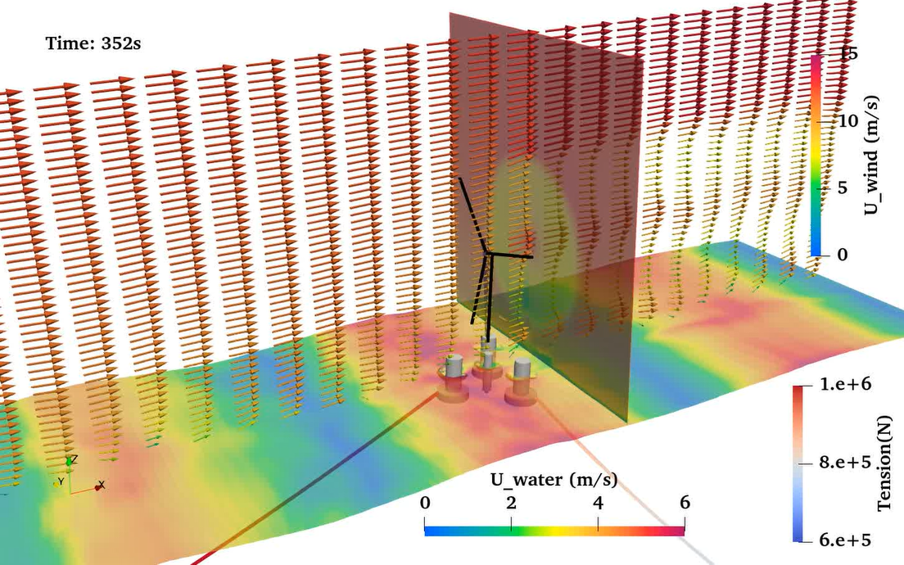

# FloatingTurbinesFoam


<p align="center">
  
</p>

<p align="center">
  <b>A specialized library for simulating Floating Offshore Wind Turbine (FOWT) motion <br> under coupled wind-wave-current environments in OpenFOAM.</b>
</p>

---

## 📋 Table of Contents
- [Introduction](#introduction)
- [Features](#features)
- [Prerequisites](#prerequisites)
- [Installation](#installation)
- [Usage](#usage)
- [Publications](#publications)
- [Acknowledgements](#acknowledgements)

---

## 📖 Introduction
**FloatingTurbinesFoam** extends the capabilities of OpenFOAM to handle the complex fluid-structure interaction (FSI) required for floating offshore wind turbines. It specifically targets the dynamic response of FOWTs subjected to simultaneous wind, wave, and current loads, providing a robust framework for marine energy research.

## ✨ Features
- **Coupled Dynamics**: Simulates 6DOF motion of floating platforms.
- **Environmental Loads**: Integrated solvers for combined wind, wave, and current interactions.
- **Mooring Systems**: Coupling with dynamic mooring line solvers.
- **Turbine Aerodynamics**: Actuator line turbine modeling.

---

## 🛠 Prerequisites

This library relies on several third-party packages. Please ensure the following are installed and compiled **before** attempting to build FloatingTurbinesFoam.

| Dependency | Version | Link | Description |
| :--- | :--- | :--- | :--- |
| **OpenFOAM** | `v2012` | [OpenFOAM.com](https://www.openfoam.com/) | Base CFD framework (Strictly tested on v2012). |
| **olaFlow** | Latest | [GitHub](https://github.com/phicau/olaFlow) | Wave generation and absorption. |
| **foamMooring**| Master | [GitLab](https://gitlab.com/hfchen20/foamMooring/-/tree/master/) | Mooring restraints for rigid body motions. |
| **kOmegaSSTStable** | - | [GitHub](https://github.com/phicau/olaFlow_supplementary) | Stabilized turbulence model for wave simulations. |
| **FloatingTurbine** | - | [GitHub](https://github.com/fronterapp/thesis-FloatingTurbine) | Base libraries from Pere Frontera's thesis. |

> [!WARNING]
> This repository is currently verified **only for OpenFOAM v2012**. Compatibility with other versions (e.g., v2112, v2206) is not guaranteed and may require source code modification.

---

## 🚀 Installation

### 1. Download Source Code
Clone this repository or copy the source folder to your OpenFOAM user directory (`$WM_PROJECT_USER_DIR`).

```bash
# Option A: Git Clone (Recommended)
cd $WM_PROJECT_USER_DIR
git clone https://github.com/Dylan000112/FloatingTurbinesFoam.git

# Option B: Manual Copy
# Assuming you have the folder 'FloatingTurbinesFoam' locally
cp -r FloatingTurbinesFoam $WM_PROJECT_USER_DIR/
```

### 2. Compile
Navigate to the directory and execute the compilation script. Ensure your OpenFOAM environment is sourced (e.g., `source /opt/openfoam2012/etc/bashrc`).

```bash
cd $WM_PROJECT_USER_DIR/FloatingTurbinesFoam

# Clean previous builds (optional)
./Allwclean

# Compile library and solvers
./Allwmake
```

---

## 💻 Usage

To run a simulation, ensure that your case structure includes the necessary dictionaries for `olaFlow` and `foamMooring`.

Typical workflow:
1. Prepare the mesh (`blockMesh`, `snappyHexMesh`).
2. Set up wave properties in `constant/waveDict`.
3. Set up mooring properties in `constant/dynamicMeshDict`.
4. Run the solver.

*(Refer to the source code `tutorials` folder if available for example setups).*

---

## 📚 Publications

If you use this code for academic research, please verify the simulation results against the following study:

Yiyong Dong, Weikai Tan, Kaiqing Luo, Yuzhu Pearl Li, Jing Yuan,
The impact of wave–current interaction on the dynamic response of a floating offshore wind turbine: A CFD investigation,
Applied Ocean Research, Volume 167, 2026, 104928, ISSN 0141-1187, https://doi.org/10.1016/j.apor.2026.104928.


## 👏 Acknowledgements

This project stands on the shoulders of giants. We gratefully acknowledge the developers of the following open-source projects:

*   **[OpenFOAM](https://openfoam.org/)**: The open source software for computational fluid dynamics (CFD), developed primarily by CFD Direct.
*   **[olaFlow](https://github.com/phicau/olaFlow)**: Developed by *Higuera et al.* for simulating wave and porous structure interactions in coastal/offshore fields.
*   **[foamMooring](https://gitlab.com/hfchen20/foamMooring/-/tree/master/)**: A mooring restraints library developed by *Haifei Chen*.
*   **[FloatingTurbine](https://github.com/fronterapp/thesis-FloatingTurbine)**: Simulation setups and libraries from the thesis "CFD Simulation of a Floating Wind Turbine with OpenFOAM", developed by *Pere Frontera*.

---

<p align="right">(<a href="#top">back to top</a>)</p>
